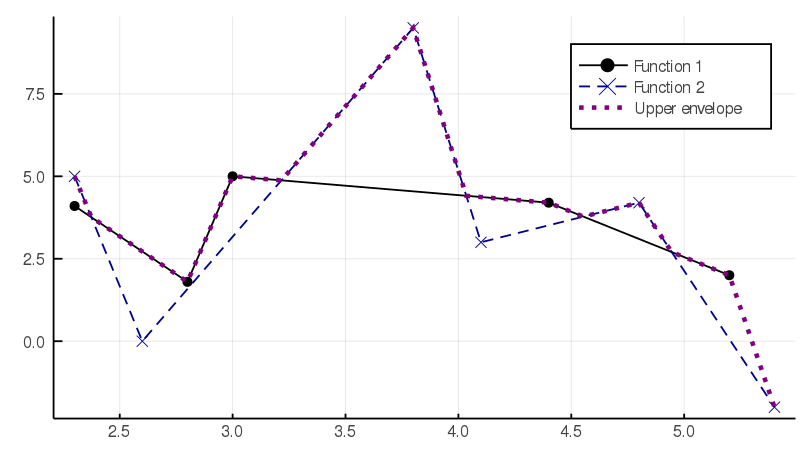

# UpperEnvelope



This package provides the function `compute_envelope`, which computes (a representation of) the "maximum" between two irregularly defined piecewise linear functions with bounded 1d support.

Each function is represented by a collection of `(x,y)` points. The result is not *exactly* a maximum because of the behavior in non-intersecting parts of the domain, as seen in the last two points. (For the particular use case this package was designed for, this behavior is desirable, so I won't implement the exact maximum any time soon. PRs welcome.)

**Important.** This package is not tested yet. Bugs are extremely likely.

## Install

```julia-repl
(v1.3) pkg> add https://github.com/pereiragc/UpperEnvelope.jl
  Updating registry at `~/.julia/registries/General`
  Updating git-repo `https://github.com/JuliaRegistries/General.git`
   Cloning git-repo `https://github.com/pereiragc/UpperEnvelope.jl`
  Updating git-repo `https://github.com/pereiragc/UpperEnvelope.jl`
  Updating git-repo `https://github.com/pereiragc/UpperEnvelope.jl`
 Resolving package versions...
  Updating `~/.julia/environments/v1.3/Project.toml`
  [c4478ca4] + UpperEnvelope v0.1.0 #master (https://github.com/pereiragc/UpperEnvelope.jl)
  Updating `~/.julia/environments/v1.3/Manifest.toml`
  [c4478ca4] + UpperEnvelope v0.1.0 #master (https://github.com/pereiragc/UpperEnvelope.jl)
```

## Usage
tba (for now see [the example](examples/gen_figure.jl))
